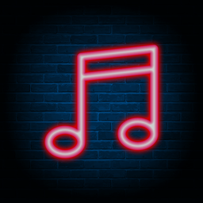

<div id="top"></div>
<!--
*** Thanks for checking out the Best-README-Template. If you have a suggestion
*** that would make this better, please fork the repo and create a pull request
*** or simply open an issue with the tag "enhancement".
*** Don't forget to give the project a star!
*** Thanks again! Now go create something AMAZING! :D
-->

<!-- PROJECT SHIELDS -->
<!--
*** I'm using markdown "reference style" links for readability.
*** Reference links are enclosed in brackets [ ] instead of parentheses ( ).
*** See the bottom of this document for the declaration of the reference variables
*** for contributors-url, forks-url, etc. This is an optional, concise syntax you may use.
*** https://www.markdownguide.org/basic-syntax/#reference-style-links
-->

[![Contributors][contributors-shield]][contributors-url]
[![Forks][forks-shield]][forks-url] [![Stargazers][stars-shield]][stars-url]
[![Issues][issues-shield]][issues-url]
[Top Language](https://img.shields.io/github/languages/top/tylerguy/Discord-Music-Bot?style=for-the-badge)


<!-- PROJECT LOGO -->
<br />
<div align="center">
  <a href="https://github.com/tylerguy/discord-music-bot">
    
  </a>

<h3 align="center">Discord Music Bot</h3>

  <p align="center">
    General Purpose Music Bot
    <br />
    <a href="https://github.com/tylerguy/discord-music-bot"><strong>Explore the docs »</strong></a>
    <br />
    <br />
    <a href="https://github.com/tylerguy/discord-music-bot/issues">Report Bug</a>
    ·
    <a href="https://github.com/tylerguy/discord-music-bot/issues">Request Feature</a>
  </p>
</div>

<!-- TABLE OF CONTENTS -->
<details>
  <summary>Table of Contents</summary>
  <ol>
    <li>
      <a href="#about-the-project">About The Project</a>
      <ul>
        <li><a href="#built-with">Built With</a></li>
      </ul>
    </li>
    <li>
      <a href="#getting-started">Getting Started</a>
      <ul>
        <li><a href="#prerequisites">Prerequisites</a></li>
        <li><a href="#installation">Installation</a></li>
      </ul>
    </li>
    <li><a href="#usage">Usage</a></li>
    <li><a href="#roadmap">Roadmap</a></li>
    <li><a href="#contributing">Contributing</a></li>
    <li><a href="#contact">Contact</a></li>
  </ol>
</details>

<!-- ABOUT THE PROJECT -->

## About The Project:

<p align="right">(<a href="#top">back to top</a>)</p>

### Built With

- [Discord.js](https://discord.js.org/)
- [FFmpeg](https://www.ffmpeg.org/)
- [Discord-Player](https://github.com/Androz2091/discord-player)
- [ytdl-core](https://github.com/fent/node-ytdl-core)

<p align="right">(<a href="#top">back to top</a>)</p>

<!-- GETTING STARTED -->

## Getting Started

This is an example of you can get started setting up your project
locally. To get a local copy up and running follow these simple example steps.

### Prerequisites

This is an example of how to list things you need to use the software and how to
install them.

- Nodejs 16 & FFmpeg
  - First make sure that your OS is up to date (for this example, I'll be using ubuntu 2004)
  
  ```sh
  sudo apt update
  sudo apt upgrade
  ```
  - Make sure that you have curl installed
  
  ```sh
  sudo apt install -y curl
  ```
  
  - Once you have ```curl``` installed, run the setup script
  
  ```sh
  curl -fsSL https://deb.nodesource.com/setup_16.x | sudo -E bash -
  ```
  
  - Once you've done that, you can go ahead and install or update your current version of node.js
  
  ```sh
  sudo apt install -y nodejs
  ```
  and FFmpeg
  ```sh
  sudo apt install -y FFmpeg
  ```
  
  - Once the installation has completed, you can run this command to make sure that the right version is installed:
  ```sh
  node --version
  ```
  ***If the result is ```v.16.x.x```, then you should be good.***
  
### Installation

1. Clone the repo
   ```sh
   git clone https://github.com/tylerguy/discord-music-bot
   ```
2. Install NPM packages
   ```sh
   npm install
   ```
3. Change your bot token in config.json
4. Run the bot
   ```sh
   node index.js
   ```
5. In your discord server, use the command ```!deploy``` to enable slash commands

6. You're all done, you can now see all the commands using ```/``` in any channel

<p align="right">(<a href="#top">back to top</a>)</p>

<!-- ROADMAP -->

## Roadmap

- [ ] Volume Control
- [ ] Lyrics Support
- [ ] Web Control Panel (for easier config)
  - [ ] Ability to change bot token
  - [ ] Restrict bot to certain user/channels
  - [ ] Change bot responses to queries

See the [open issues](https://github.com/tylerguy/discord-music-bot/issues) for a full
list of proposed features (and known issues).

<p align="right">(<a href="#top">back to top</a>)</p>

<!-- CONTRIBUTING -->

## Contributing

Contributions are what make the open source community such an amazing place to
learn, inspire, and create. Any contributions you make are **greatly
appreciated**.

If you have a suggestion that would make this better, please fork the repo and
create a pull request. You can also simply open an issue with the tag
"enhancement". Don't forget to give the project a star! Thanks again!

1. Fork the Project
2. Create your Feature Branch (`git checkout -b feature/AmazingFeature`)
3. Commit your Changes (`git commit -m 'Add some AmazingFeature'`)
4. Push to the Branch (`git push origin feature/AmazingFeature`)
5. Open a Pull Request

<p align="right">(<a href="#top">back to top</a>)</p>

<!-- CONTACT -->

## Contact

Tyler Denman - [@tylerdenman18](https://twitter.com/TylerDenman18) -
tylerdenman200@gmail.com

Project Link:
[https://github.com/tylerguy/discord-music-bot](https://github.com/tylerguy/discord-bot)

<p align="right">(<a href="#top">back to top</a>)</p>

<!-- MARKDOWN LINKS & IMAGES -->
<!-- https://www.markdownguide.org/basic-syntax/#reference-style-links -->

[contributors-shield]:
  https://img.shields.io/github/contributors/tylerguy/discord-music-bot.svg?style=for-the-badge
[contributors-url]: https://github.com/tylerguy/discord-bot/graphs/contributors
[forks-shield]:
  https://img.shields.io/github/forks/tylerguy/discord-music-bot.svg?style=for-the-badge
[forks-url]: https://github.com/tylerguy/discord-bot/network/members
[stars-shield]:
  https://img.shields.io/github/stars/tylerguy/discord-music-bot.svg?style=for-the-badge
[stars-url]: https://github.com/tylerguy/discord-bot/stargazers
[issues-shield]:
  https://img.shields.io/github/issues/tylerguy/discord-music-bot.svg?style=for-the-badge
[issues-url]: https://github.com/tylerguy/discord-bot/issues
[license-shield]:
  https://img.shields.io/github/license/tylerguy/discord-music-bot.svg?style=for-the-badge
[license-url]: https://github.com/tylerguy/discord-bot/blob/master/LICENSE.txt
